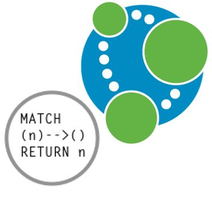

## Cypher - The Neo4J DB Query Language

- Cypher is a declarative language for querying property graphs that uses "patterns" as its main building blocks.

- Cypher's declarative syntax provides a familiar way to match patterns of nodes and relationships in the graph.

- It is backed by several companies in the database space and allows implementors of databases and clients to freely benefit, use from and contribute to the development of the openCypher language.



### Graph Patterns in Cypher (Projection)

- Patterns are expressed syntactically following a "pictorial" intuition to encode nodes and edges with arrows between them.

- The following queries ask for co-stars of the *"Unforgiven"* movie. 

[.column]
```sql
MATCH (x:Person)-[:acts_in]->
	(m:Movie {title: "Unforgiven"})
		<-[:acts_in]-(y:Person)
RETURN x,y
```
[.column]
```sql

MATCH (x:Person)-[:acts_in]->(m:Movie 
	{title: "Unforgiven"})
(y:Person)-[:acts_in]->(m) 
RETURN x,y

```

^ In this case, we would also get the matches that send both x and y to the node of Clint Eastwood (and likewise to the node of Anna Levine).

### Comple Graph Patterns in Cypher: Union

```sql

MATCH (:Person 
	{name:"Clint Eastwood"})-[:acts_in]->(m:Movie)
RETURN m.title
UNION ALL 
MATCH (:Person 
	{name:"Clint Eastwood"})-[:directs]->(m:Movie)
RETURN m.title

```

### Comple Graph Patterns in Cypher: Difference

```sql

MATCH (p:Person)-[:acts_in]->(m:Movie 
	{title: "Unforgiven"})
WHERE NOT (p)-[:direct]->(m)
RETURN m.title

```

### Comple Graph Patterns in Cypher: Optional

```sql

MATCH (p:Person)-[:acts_in]->(m:Movie)
OPTIONAL MATCH (p)-[x]->(m)
WHERE type(x) <> "acts_in"
RETURN p.name, m.title, type(x)

```

### Navigational Queries in Cypher

- While not supporting full regular expressions, Cypher still allows transitive closure over a single edge label in a property graph.

- Since it is designed to run over property graphs, Cypher also allows the star to be applied to an edge property/value pair.

- **Example**: compute the friend-of-a-friend relation.  The following query selects pairs of nodes that are linked by a path completely labelled by knows. To do this, it applies the star operator * over the label knows .

```sql

MATCH (x:Person)-[:knows*]->(y:Person)
RETURN x,y

```

### Navigational Queries in Cypher

- Example 2. If we wanted to find friends of friends of Julie and return only the shortest witnessing path. This will return a single shortest witnessing path. If we wanted to return all shortest paths, then we could replace "shortestPath" with "allShortestPaths".

```sql

MATCH (x:Person {firstname:"Julie"}),
p = shortestPath( (x)-[:knows*]->(y:Person))
RETURN p

```
 
- Example 3. Coming back to the social network, if we want to find all friends of-friends of Julie that liked a post with a tag that Julie follows, we can use the following Cypher query:

```sql

MATCH (x:Person {firstname:"Julie"})-[:knows*]->(y:Person))
MATCH (y)-[:likes]->()->[:hasTag]->(z)
MATCH (z)-[:hasFollower]->(x)
RETURN y

```

### Navigational Queries Cypher

- Another interesting feature available in Cypher is the ability to return paths.

- Example 4. If we wanted to return all friends of friends of Julie in the graph, together with a path witnessing the friendship, then we can use:

```sql

MATCH p = (:Person name:"Julie")-[:knows*]->(x:Person)
RETURN x,p

```

- Result will be:

|x|p|
|-------|--------|
|Node[2]|[Node[1],:knows[1],Node[2]]|
|Node[1]|[Node[1],:knows[1],Node[2],:knows[2],Node[1]]|

