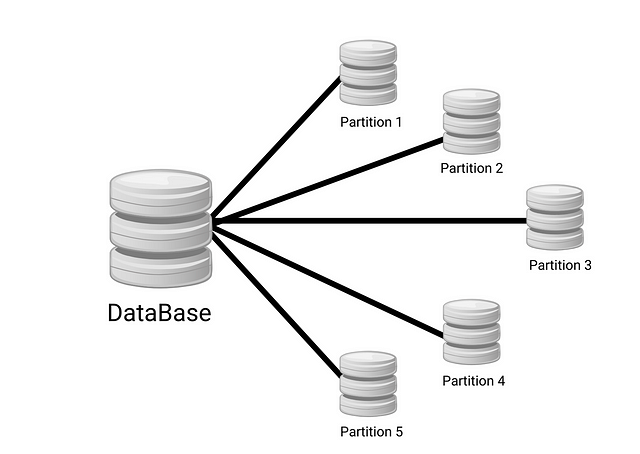
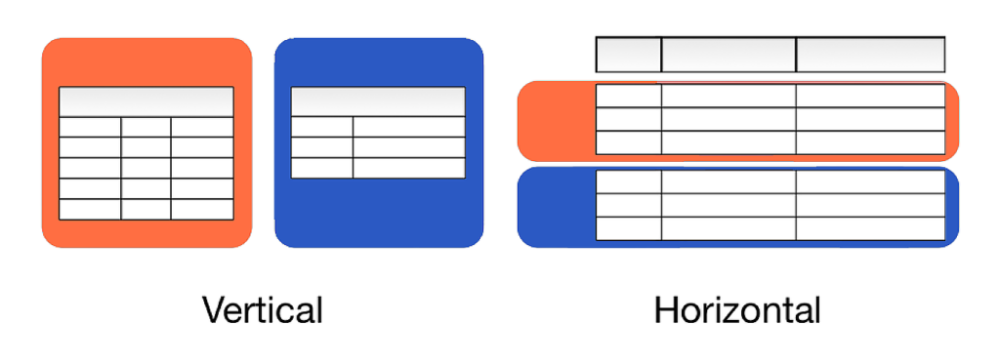
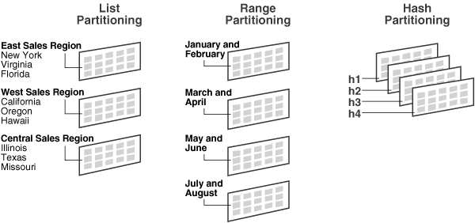
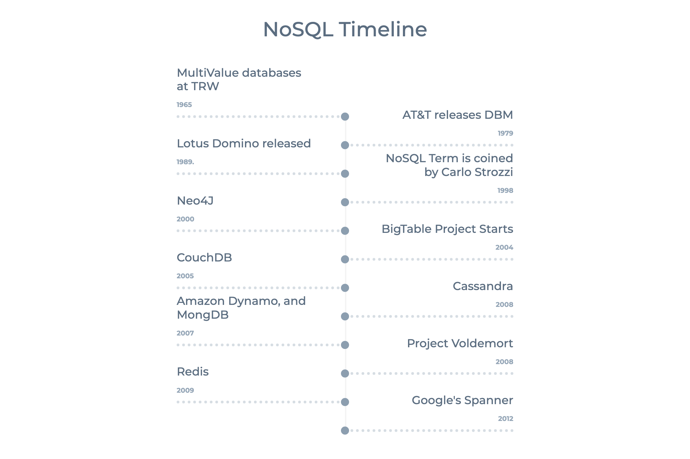
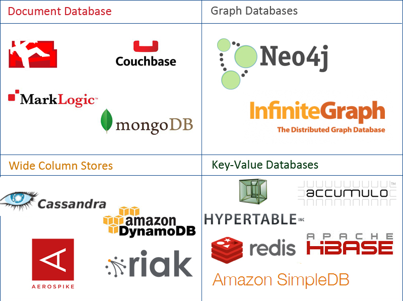
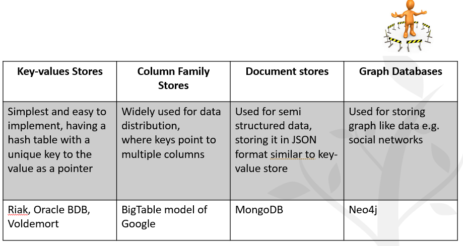
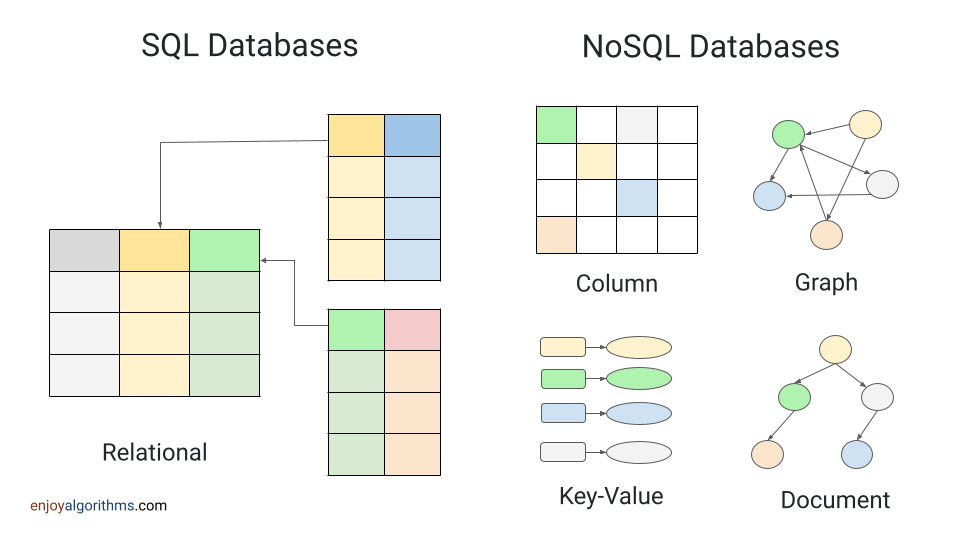
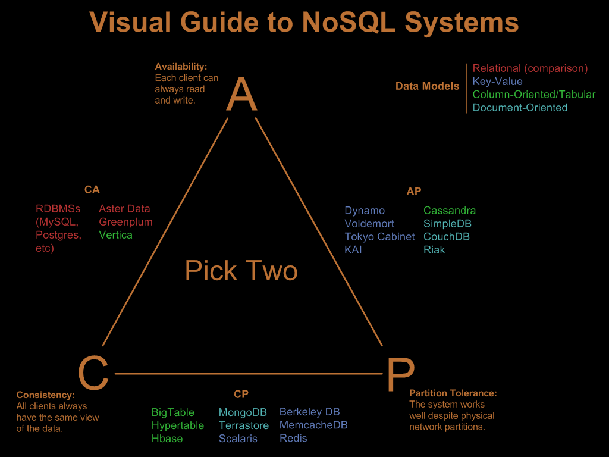

footer:  [Riccardo Tommasini](http://rictomm.me) - riccardo.tommasini@insa-lyon.fr - @rictomm 
slide-dividers: #, ##, ###
slidenumbers: true
autoscale: true
build-lists: true
theme: Plain Jane

## [IF-5-OT7:TD] Foundation of data engineering
#### MCF Riccardo Tommasini
#### [http://rictomm.me](http://rictomm.me)
#### [riccardo.tommasini@insa-lyon.fr](mailto:riccardo.tommasini@insa-lyon.fr)
 
[.column]

 

[.column]

---
# CAP Theorem 

Also known as Brewer’s Theorem

It is impossible for a distributed computer system to simultaneously provide all three of the following guarantees:

- **Consistency**: all nodes see the same data at the same time
- **Availability**: Node failures do not prevent other survivors from continuing to operate (a guarantee that every request receives a response whether it succeeded or failed)
- **Partition tolerance**: the system continues to operate despite arbitrary partitioning due to network failures (e.g., message loss)

A distributed system can satisfy any two of these guarantees at the same time but not all three.

---

## The network is not reliable

In a distributed system, **a network (of networks) ** failures can, and will, occur.

Since We cannot neglect Partition Tolerance the remaining option is choosing between **Consistency** and **Availability**. 

--- 
## We cannot neglect Partition Tolerance
Not necessarily in a mutually exclusive manner:
	
- CP:  A partitioned node returns
	- the correct value
	- a timeout error or an error, otherwise
- AP: A partitioned node returns the most recent version of the data, which could be stale.

## Implications of CAP Theorem (TODO)

- change the transactionality gurantees
- redesign the data workflow ()
- reimagine the data processing systems (noSQL)

## Parents example

Explaining CAP Theorem To a 6 years old

## Consistency

Asking mum or dad about something will always get the same answer

if they are in different rooms, they have to agree upon the answer, therefore cannot be alwats available 

## Partition Tolerance

If mum or data are not in the same room, I can still ask for help

## Availability

Whenever I ask for help, mum or dad will answer me

if they are in the same room, they can ear each other's answer and don't have to spend time agreeing upon things.
## Implications of CAP Theorem 

- change the transactional guarantees (ACID Model)
- redesign the data workflow (Schema On Read)
- reimagine the data processing systems (noSQL)

---

# Data Partitioning 

 > breaking a large database down into smaller ones

^ For very large datasets, or very high query throughput, that is not sufficient

## Reasons for Partitioning

- The main reason for wanting to partition data is scalability[^13]

- Database operations become slower.
- Network bandwidth starts reaching the saturation level. 
- The database server starts running out of disk space at some point.
 
^ 
- Different partitions can be placed on different nodes in a shared-nothing cluster
- Queries that operate on a single partition can be independently executed. Thus, throughput can be scaled by adding more nodes.

## What to know 

- If some partitions have more data or queries than others the partitioning is **skewed**
- A partition with disproportionately high load is called a **hot spot**
- For reaching maximum scalability (linear) partitions should be balanced

Let's consider some partitioning strategies, for simplicity we consider Key,Value data.

## Vertical vs Horizontal Partitioning

### Horizontal Partitioning

Horizontal partitioning (also known as database sharding) is a strategy for splitting **table** data based on the range of values defined by a partition key. 

Here we divide the table into smaller and more manageable tables, with each row of the table being assigned to one of the partitions. 

- We need to identify a partition key  for distributing the data among all the partitions. 
- We need to balance the number of requests between partitions to ensure that none become overloaded.

^ When a query is made using the partition key, the database will determine which partition it needs to query.

### Vertical Partitioning

Vertical partitioning (also known as normalization) divides a table into smaller tables based on columns. 

It may be necessary to combine data from multiple partitions to answer a query, which can increase the operational complexity.

## Partitioning Strategies

- **Round-robin** randomly assigns new keys to the partitions. 
	- Ensures an even distribution of tuples across nodes; 
- **List Partitioning** selects keys based on a list of values for a particular column, rather than a set of contiguous ranges.
- **Range partitioning** assigns a contiguous key range to each node. 
	- Not necessarily balanced, because data may not be evenly distributed
- **Hash partitioning** uses a hash function to determine the target partition. 	- If the hash function returns i, then the tuple is placed

## Partitioning Strategies Visualised

[source](https://www.enjoyalgorithms.com/blog/data-partitioning-system-design-concept)

# Data Replication (aka Sharding)

> Replication means keeping a copy of the same data on multiple machines that are connected via a network

## Reasons for Replication

- Increase data locality
- Fault tolerance
- Concurrent processing (read queries)

^ 
- To keep data geographically close to your users (and thus reduce access latency)
- To allow the system to continue working even if some of its parts have failed (and thus increase availability) 
- To scale out the number of machines that can serve read queries (and thus increase read throughput)

## Approaches

- Synchronous vs Asynchronous Replication
	- The advantage of synchronous replication is that the follower is guaranteed to have an up-to-date copy 
	- The advantage of asynchronous replication is that follower's availability is not a requirement (cf CAP Theorem)

- Leader - Follower (Most common cf Kafka)

## Leaders and Followers

- One of the replicas is designated as the leader
- Write requests go to the leader
- leader sends data to followers for replication
- Read request may be directed to leaders or followers

---

Source is [^13]

## Caveats

 
 
Only one: handling changes to replicated data is extremely hard.

# The Advent of NoSQL

> Google, Amazon, Facebook, and DARPA all recognised that when you scale systems large enough, you can never put enough iron in one place to get the job done (and you wouldn’t want to, to prevent a single point of failure). 
 
> Once you accept that you have a distributed system, you need to give up consistency or availability, which the fundamental transactionality of traditional RDBMSs cannot abide.
   --[Cedric Beust](https://beust.com/weblog/2010/02/25/nosql-explained-correctly-finally/)

^  The name “NoSQL” is unfortunate, since it doesn’t actually refer to any particular technology—it was originally intended simply as a catchy Twitter hashtag for a meetup on open source, distributed, non-relational databases in 2009 Cf Pramod J. Sadalage and Martin Fowler: NoSQL Distilled. Addison-Wesley, August 2012. ISBN: 978-0-321-82662-6
## The Reasons Behind

- **Queryability**: need for specialised query operations that are not well supported by the relational model
- **Schemaless**:  desire for a more dynamic and expressive data model than relational
- **Flexibility**: need to accomodate the "schema on read" phylosophy

^ 
	- **Big Data**: need for greater scalability than relational databases can easily achieve *in write*
	- **Open Source:** a widespread preference for free and open source software 

### Object-Relational Mismatch 

Most application development today is done in **object-oriented** programming languages

An **awkward translation** layer is required between the **objects** in the application code and the database model of **tables**, **rows**, and **columns**

Object-relational mapping (**ORM**) frameworks like **Hibernate** try to mild the mismatch, but they **can’t completely hide** the differences

---

^ the idea of NOSQL actually originates in the late 60s together with the raise of the raise of object-oriented languages, but become popular later.

## NoSQL Family

## NoSQL Comparative View

### NoSQL Detailed View

- **Document stores** pair each key with a complex data structure known as a document.
- **Graph stores** are used to store information about networks of data, such as social connections. e.g., Neo4J 
- **Key-value** stores are the simplest NoSQL databases. Every single item in the database is stored as an attribute name (or ’key’), together with its value.
- **Wide-column stores** are optimised for queries over large datasets, and store columns of data together, instead of rows.

###  Data Modelling for NoSQL

- **Conceptual Level** remains:
	- ER, UML diagram can still be used for no SQL as they output a model that encompasses the whole company.

- **Phsyical Level** remains: NoSQL solutions often expose internals for obtaining flexibility, e.g., 
	- Key-value stores API
	- Column stores
	- Log structures

- _Logical level no longer make sense. Schema on read focuses on the query side.__

---

### Kinds of NoSQL (2/4)

NoSQL solutions fall into four major areas:

- **Key-Value Store**
	- A key that refers to a payload (actual content / data)
	- Examples: MemcacheDB, Azure Table Storage, Redis, HDFS

- **Column Store** 
	- Column data is saved together, as opposed to row data
	- Super useful for data analytics
	- Examples: Hadoop, Cassandra, Hypertable

---

### Kinds of NoSQL (4/4)

- **Document / XML / Object Store**
	- Key (and possibly other indexes) point at a serialized object
	- DB can operate against values in document
	- Examples: MongoDB, CouchDB, RavenDB

- **Graph Store**
	- Nodes are stored independently, and the relationship between nodes (edges) are stored with data
	- Examples: AllegroGraph, Neo4j

---

###  Complexity Across Families

---
### Dependencies Across Families

^ a natural evolutionary path exists from simple key-value stores to the highly complicated graph databases, as shown in the following diagram:

---

### SQL vs  NoSQL

| SQL databases                              | NoSQL  databases                                                                                     |
| ------------------------------------------ | ---------------------------------------------------------------------------------------------------- |
| Triggered the need of relational databases | Triggered by the storage needs of Web 2.0 companies such as Facebook,Google and Amazon.com           |
| Well structured data                       | Not necessarily well structured – e.g., pictures, documents, web page description, video clips, etc. |
| Focus on data integrity                    | focuses on availability of data even in the presence of multiple failures                            |
| Mostly Centralised                         | spread data across many storage systems with a high degree of replication.                           |
| ACID properties should hold                | ACID properties may not hold[^62]                                                                    |
|                                            |                                                                                                      |

[^6 g2]: no properties at all???

---

## NoSQL & CAP Theorem

---

[.footer: [img](https://blog.nahurst.com/visual-guide-to-nosql-systems)]

---

### The ~~OLD~~ ACID Model

-   ACID, which stands for Atomicity, Consistency, Isolation, and Durability[1-1](obsidian://open?vault=dataeng&file=1-1.md)(app://obsidian.md/index.html#fn-1-799ed3e7c985b657)
    
-   **Atomicity** refers to something that cannot be broken down into smaller parts.
    
    -   It is not about concurrency (which comes with the I)
-   **Consistency** (overused term), that here relates to the data _invariants_ (integrity would be a better term IMHO)
    
-   **Isolation** means that concurrently executing transactions are isolated from each other.
    
    -   Typically associated with serializability, but there weaker options.
-   **Durability** means (fault-tolerant) persistency of the data, once the transaction is completed.
    

^ The terms was coined in 1983 by Theo Härder and Andreas Reuter [6](obsidian://open?vault=dataeng&file=6.md)(app://obsidian.md/index.html#fn-6-799ed3e7c985b657)

---

### Rationale to Change

- It’s ok to use stale data (Accounting systems do this all the time. It’s called “closing out the books.”) ; 
- It’s ok to give approximate answers
- Use resource versioning -> say what the data really is about – no more, no less
	- the value of x is 5 at time T

---

### The New BASE Model

BASE(Basically Available, Soft-State, Eventually Consistent)

- **Basic Availability**: fulfill request, even in partial consistency.
- **Soft State**: abandon the consistency requirements of the ACID model pretty much completely
- **Eventual Consistency**: delayed consistency, as opposed to immediate consistency of the ACID properties[^67].
  - purely aliveness guarantee (reads eventually return the requested value); but
  - does not make safety guarantees, i.e.,
  - an eventually consistent system can return any value before it converges

[^67]: at some point in the future, data will converge to a consistent state; 

---

### ACID vs. BASE trade-off

**No general answer** to whether your application needs an ACID versus BASE consistency model.

Given **BASE** ’s loose consistency, developers **need to** be more knowledgeable and **rigorous** about **consistent** data if they choose a BASE store for their application.

Planning around **BASE** limitations can sometimes be a major **disadvantage** when compared to the simplicity of ACID transactions.

A fully **ACID** database is the perfect fit for use cases where data **reliability** and **consistency** are essential.

---

## Extra Reads

- [History of Data Models by Ilya Katsov](https://highlyscalable.wordpress.com/2012/03/01/nosql-data-modeling-techniques/)

- [Life beyond Distributed Transactions](https://www.ics.uci.edu/~cs223/papers/cidr07p15.pdf)

---