footer:  [Riccardo Tommasini](http://rictomm.me) - riccardo.tommasini@insa-lyon.fr - @rictomm 
slide-dividers: #, ##, ###
slidenumbers: true
autoscale: true
build-lists: true
theme: Plain Jane

### [IF-5-OT7:TD] Foundation of data engineering
#### MCF Riccardo Tommasini
#### [http://rictomm.me](http://rictomm.me)
#### [riccardo.tommasini@insa-lyon.fr](mailto:riccardo.tommasini@insa-lyon.fr)
 
[.column]

<br>


[.column]


---

## Data Modelling

> It is the process of defining the structure of the data for the purpose of communicating[^11] or to develop an information systems[^12].

[^11]: between functional and technical people to show data needed for business processes

[^12]: between components of the information system, how data is stored and accessed.


---

###  What is a data model? 

- A data model represents the structure and the integrity of the data elements of a (single) applications [2](x-bdsk://DBLP:journals/sigmod/SpynsMJ02) 

- Data models provide a framework for data to be used within information systems by giving specific definitions and formats.

- The literature of data management is rich of data models that aim at providing increased expressiveness to the modeller and capturing a richer set of semantics.


---

### Any Example?

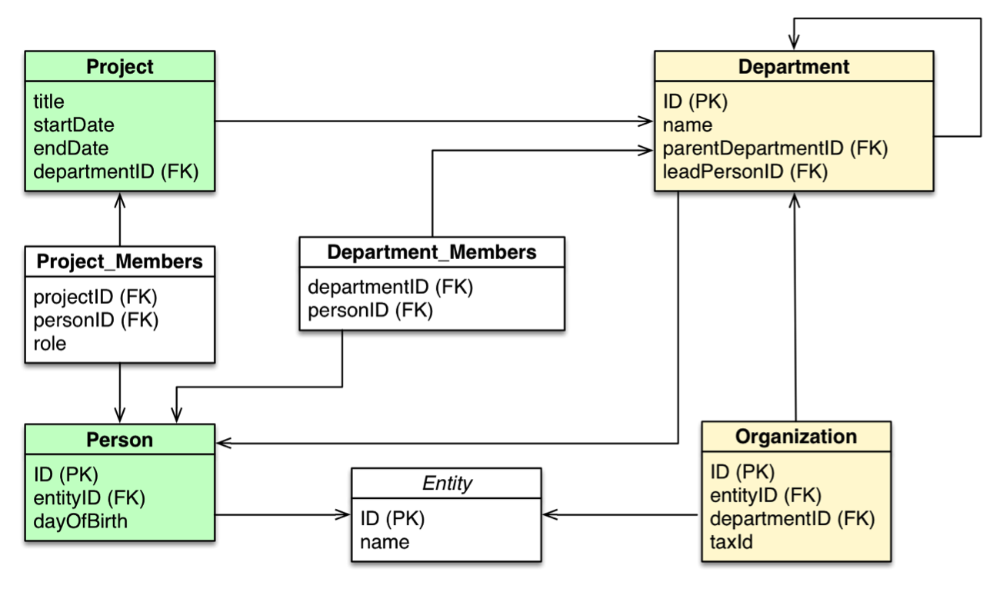

---

## History of Data Models[^5]

--- 


[^5]: [by Ilya Katsov](https://highlyscalable.wordpress.com/2012/03/01/nosql-data-modeling-techniques/)

---

> Data models are perhaps the most important part of developing software. They have such a profound effect not only on how the software is written, but also on how we think about the problem that we are solving[^13].
> --Martin Kleppmann


[^13]:[Designing Data-Intensive Applications](https://dataintensive.net/)

---


---

### Level of Data Modeling

**Conceptual**: The data model defines *WHAT* the system contains.

^ Conceptual model is typically created by Business stakeholders. The purpose is to organize, scope and define business concepts and rules. Definitions are most important this level.

**Logical**: Defines *HOW* the system should be implemented regardless of the DBMS. 

^ Logical model is typically created by Data Architects. The purpose is to developed technical map of rules and data structures. Business rules, relationships, attribute become visible. Conceptual definitions become metadata.

**Physical**: This Data Model describes *HOW* the information system will be implemented using a specific technology [^14].

^ Physical model is typically created by DBA and developers. The purpose is actual implementation of the database. Trade-offs are explored by in terms of data structures and algorithms.


[^14]: [physical](https://www.databass.dev/)

---

### A Closer Look[^15]


[^15]: [slides](https://www.slideshare.net/Dataversity/data-modeling-for-big-data) & [video](https://www.dataversity.net/ldm-webinar-data-modeling-big-data/) by Donna Burbank

^ The variety of data available today encourages the design and development of dedicated data models and query languages that can improve both BI as well as the engineering process itself.

---


---

### Conceptual

- Semantic Model (divergent)
	- Describes an enterprise in terms of the language it uses (the jargon).
	- It also tracks inconsistencies, i.e., semantic conflicts 

- Architectural Model (convergent)
	- More fundamental, abstract categories across enterprise 

---

### Logical 

Already bound to a technology, it typically refers already to implementation details

- Relational
- Hierarchical
- Key-Value
- Object-Oriented
- Graph

^ Since it has a physical bias, you might be tempted to confuse this with the physical model, but this is wrong. 

---

### Physical

The physical level describes how data are **Stored** on a device.

- Data formats
- Distribution
- Indexes
- Data Partitions
- Data Replications

<br>

...an you are in the Big Data World

---

### Data Modelling Techniques 

According to Len Silverston (1997) only two modelling methodologies stand out, top-down and bottom-up.


- Bottom-up models or View Integration models are often the result of a [reengineering](https://en.wikipedia.org/wiki/Reengineering_(software) "Reengineering (software)") effort.  These models are usually physical, application-specific, and incomplete from an [enterprise perspective](https://en.wikipedia.org/wiki/Enterprise_architecture "Enterprise architecture"). They may not promote data sharing, especially if they are built without reference to other parts of the organization.[7](obsidian://open?vault=Notes&file=7.md)(https://en.wikipedia.org/wiki/Data_modeling#cite_note-SIG97-7)

- Top-down [logical data models](https://en.wikipedia.org/wiki/Logical_data_model "Logical data model"), on the other hand, are created in an abstract way by getting information from people who know the subject area. A system may not implement all the entities in a logical model, but the model serves as a reference point or template.[7](obsidian://open?vault=Notes&file=7.md)(https://en.wikipedia.org/wiki/Data_modeling#cite_note-SIG97-7)

source: [wikipedia](https://en.wikipedia.org/wiki/Data_modeling)

### Data Modeling Techniques[^18]

- **Entity-Relationship (ER) Modeling**[^19] prescribes to design model encompassing the whole company and describe enterprise business through Entities and the relationships between them	
		-   it complies with 3rd normal form
		-   tailored for OLTP

- **Dimensional Modeling** (DM)[^110] focuses on enabling complete requirement analysis while maintaining high performance when handling large and complex (analytical) queries
	-  The star model and the snowflake model are examples of DM
	-  tailored for OLAP


### Data Modeling Techniques[^18]
 
- **Data Vault  (DV) Modeling**[^111] focuses on data integration trying to take the best of ER 3NF and DM
		-  emphasizes establishment of an suitable basic data layer focusing on data history, traceability, and atomicity
		-  one cannot use it directly for data analysis and decision making
- **Domain Driven Design**[^112]  focuses on designing software based on the underlying domain.
	- promotes the usage of an ubiquitous language help communication between software developers and domain experts.
	- replaces the conceptual level for NOSQL

[^18]: [source](https://dzone.com/articles/a-comparison-of-data-modeling-methods-for-big-data)
[^19]: by Bill Inmon
[^110]: Ralph Kimball, book ‘The Data Warehouse Toolkit — The Complete Guide to Dimensional Modeling"
[^111]: [https://en.wikipedia.org/wiki/Data_vault_modeling](https://en.wikipedia.org/wiki/Data_vault_modeling)
[^112]: Evans, Eric. Domain-driven design: tackling complexity in the heart of software. Addison-Wesley Professional, 2004.

## Let's Talk about Workloads

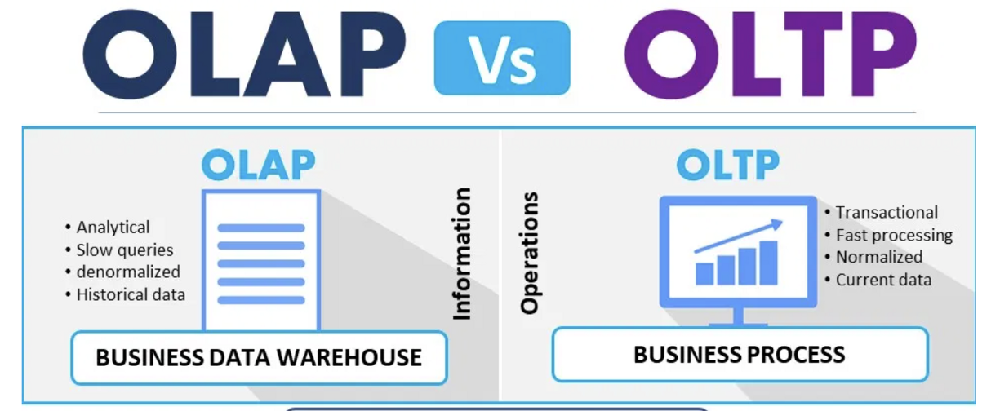

^ 
- **OLTP** systems are usually expected to be **highly available** and to process transactions with low latency, since they are often critical to the operation of the business.
- **OLAP** queries are often written by business analysts, and feed into reports that help the management of a company make better decisions (business intelligence).

### Online Transactional Processing

Because these applications are interactive, the access pattern became known as **online**

**Transactional** means allowing clients to make low-latency reads and writes—as opposed to batch processing jobs, which only run periodically (for example, once per day).

### Transactional: Refresh on ACID Properties

- ACID, which stands for Atomicity, Consistency, Isolation, and Durability[^11]
- **Atomicity** refers to something that cannot be broken down into smaller parts. It is not about concurrency (which comes with the I)
- **Consistency** (overused term), that here relates to the data *invariants* (integrity would be a better term IMHO)
- **Isolation** means that concurrently executing transactions are isolated from each other. Typically associated with serializability, but there weaker options.
- **Durability** means (fault-tolerant) persistency of the data, once the transaction is completed.

^ The terms was coined in 1983 by Theo Härder and Andreas Reuter [^16]

[^16]: Theo Härder and Andreas Reuter: “Principles of Transaction-Oriented Database Recovery,” ACM Computing Surveys, volume 15, number 4, pages 287–317, December 1983. doi:10.1145/289.291

### Online Analytical Processing

An OLAP system allows a data analyst to look at different cross-tabs on the same data by interactively selecting the attributes in the cross-tab

Statistical analysis often requires grouping on multiple attributes.

### Analytical: Refresh on Analytical Operators[^17]

- **Pivoting**: changing the columns with rows
- **Slicing**: creating a cross-tab for fixed values only. E.g fixing color to white and size to small
dimensions are fixed.
- **Rollup**: moving from finer-granularity data to a coarser granularity. E.g. moving from aggregates by day to aggregates by month or year
- **Drill Down**: The opposite operation - that of moving from coarser granularity data to finer-granularity data

[^17]: Database System Concepts Seventh Edition Avi Silberschatz  Henry F. Korth, S. Sudarshan McGraw-Hill ISBN 9780078022159 [link](https://www.db-book.com/db7/slides-dir/PDF-dir/ch11.pdf)

### Summary OLTP vs OLAP[^13]

| Property             | OLTP                                              | OLAP                                      |
| -------------------- | ------------------------------------------------- | ----------------------------------------- |
| Main read pattern    | Small number of records per query, fetched by key | Aggregate over large number of records    |
| Main write pattern   | Random-access, low-latency writes from user input | Bulk import (ETL) or event stream         |
| Primarily used by    | End user/customer, via web application            | Internal analyst, for decision support    |
| What data represents | Latest state of data (current point in time)      | History of events that happened over time |
| Dataset size         | Gigabytes to terabytes                            | Terabytes to petabytes                    |

## Data Modelling for Data Warehouses

- Works in phases related to the aforementioned levels of abstractions
- Less diversity in the data model, usually relational in the form of a star schema (also known as dimensional modeling[^41]).
- Redundancy and incompleteness are not avoided, fact tables often have over 100 columns, sometimes several hundreds.
- Optimized for OLAP

^ 
- The data model of a data warehouse is most commonly relational, because SQL is generally a good fit for analytic queries.
- Do not associate SQL with analytic, it depends on the data modeling. 

[^41]: Ralph Kimball and Margy Ross: The Data Warehouse Toolkit: The Definitive Guide to Dimensional Modeling, 3rd edition. John Wiley & Sons, July 2013. ISBN: 978-1-118-53080-1

### A Star is Born

[.column]


[.column]


### A Star is Born

[.column]


[.column]


## Dimensional Modeling

### What is dimensional modeling?

Dimensional modeling is widely accepted as the preferred technique for presenting analytic data because it addresses two simultaneous requirements:

- Deliver data that’s understandable to business users.
- Deliver fast query performance.

It is a longstanding technique for making databases simple.

---

### Main flow of dimensional modeling

1. **Select the business process**
	- A _business process_ is a set of activities with a goal.  
		- BPs are critical activities that your organization performs, e.g., registering students for a class.
	- Events from the process produce metrics.
	- Most fact tables model one process.
	- Choosing the process sets the design target.
2. **Declare the grain**
	- Grain: what one row in the fact table represents.
	- Everything (facts and dimensions) must align to the grain.
	- Start atomic: model at the lowest captured level possible.
	- Don’t mix grains.

### Main flow of dimensional modeling
	
3. **Identify the dimensions**
	- Dimensions provide context ("features").
	- Used for filtering, grouping, and labeling.
	- Dimensions give meaning to data.
	- Spend more effort modeling dimensions than facts.
        
4. **Identify the facts**
	- Facts are numeric measurements produced by the business process.
	- Prefer modeling **physical events**.

### Facts and dimensions

- **Facts** are the measurements that result from a business process event and are almost always numeric. 
- **Dimensions** provide context to business process events, e.g.,  who, what, where, when, why, and how. 

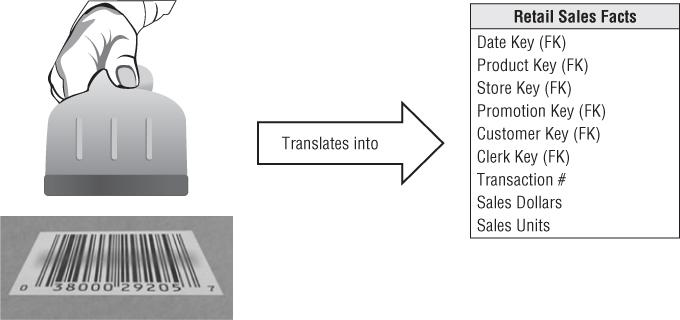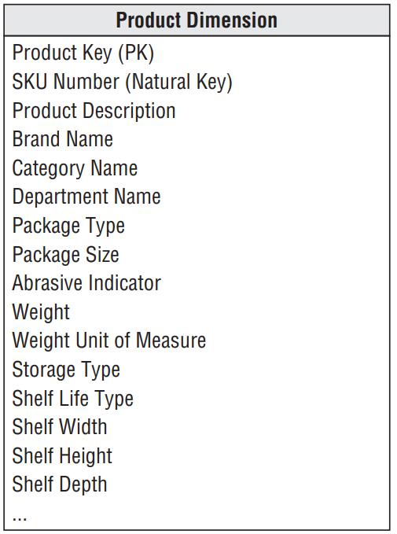


### Star schema

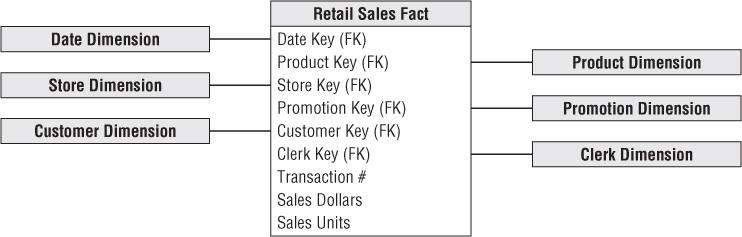

### Facts

[.column]

- Each row corresponds to a **measurement event**.    
- Most useful facts are **numeric** and **additive**.
- **Keys**
    - Fact tables usually have at least two foreign keys.
    - Composite primary key often formed by some/all dimension keys.
    - May also include a *surrogate key*, i.e., a unique identifier that you add to a table to support star schema modeling. By definition, it's not defined or stored in the source data
- The data on each row is at a specific **level of detail (grain)**.
- Grain should be **consistent** for the entire fact table.

[.column]

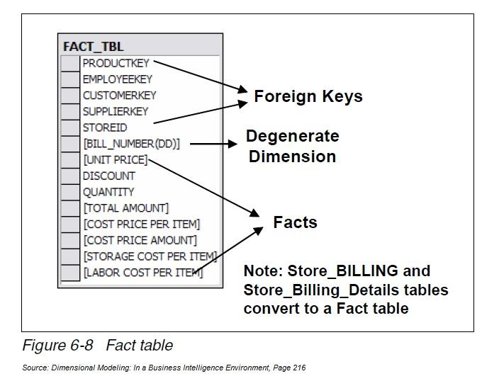

### Facts: Grain types

The **grain** establishes exactly what a single fact table row represents.  Three common grains categorize all fact tables: transactional, periodic snapshot, or accumulating snapshot. 
 
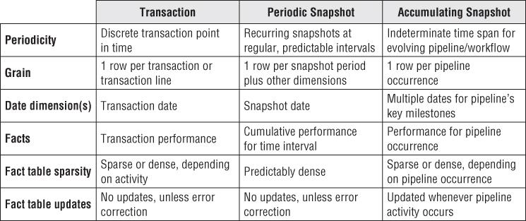

---

### Dimensions

- Contain the **textual context** associated with a measurement event.
- Describe the **who, what, where, when, how, and why**.
- Generally **fewer rows, more columns** than fact tables.
- Use a **single surrogate primary key**.
- **Heuristic:** identify dimensions with “_by_” phrases:
  - Sales **by** store
  - Clicks **by** customer
  - Events **by** line
        
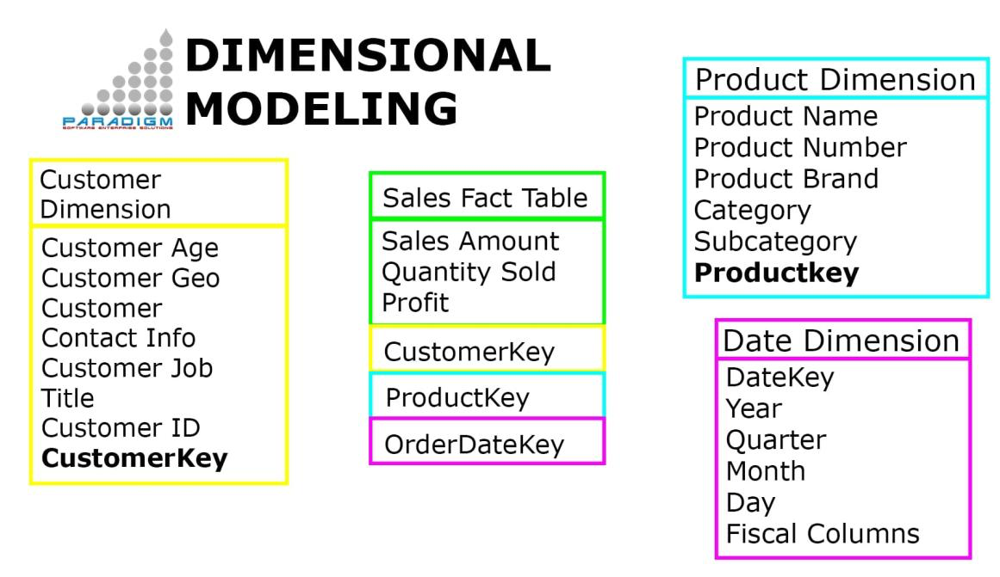


### Slowly Changing Dimensions (SCD)

What happens if something “changes”?
- A customer moves
- Product price changes?

### Slowly Changing Dimensions (SCD)

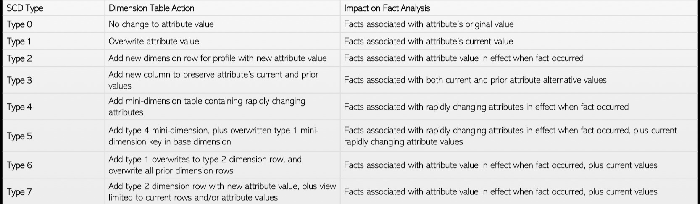

### Slowly Changing Dimensions (SCD)

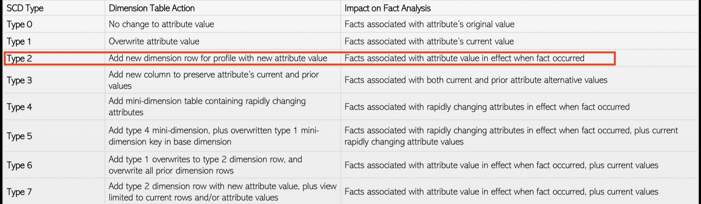

### Queryable Table

|Type|Dimension Table Action|Impact on Fact Analysis|
|---|---|---|
|**0**|No change to attribute value|Facts remain associated with the original attribute value|
|**1**|Overwrite attribute value|Facts associated with the **current** value|
|**2**|Add a new dimension row with the new attribute value|Facts associated with the value **in effect when the fact occurred**|
|**3**|Add a new column to preserve current and prior values|Facts analyzable by both current and prior alternative values|
|**4**|Add a mini‑dimension for rapidly changing attributes|Facts associated with the rapidly changing attributes in effect at the time|
|**5**|Type 4 mini‑dimension **plus** type 1 overwrite of mini‑dimension key in base dimension|Facts associated with rapidly changing attributes in effect at the time **plus** current rapidly changing values|
|**6**|Type 2 with type 1 overwrites (a.k.a. hybrid)|Facts associated with historical value **plus** current values|
|**7**|Type 2 with a view limited to current rows/values|Facts associated with historical value **plus** current values|

### Common patterns

- **Type 1:** Overwrite in place.
    
- **Type 2:** Add a new row; invalidate (or end‑date) the old row.
    

---

### Bus matrix

[.column]

- A **blueprint/design tool**.
    
- **Rows:** business processes.
    
- **Columns:** (core) dimensions.
    
- Mark with **X** where a dimension participates in a process.
    
[.column]

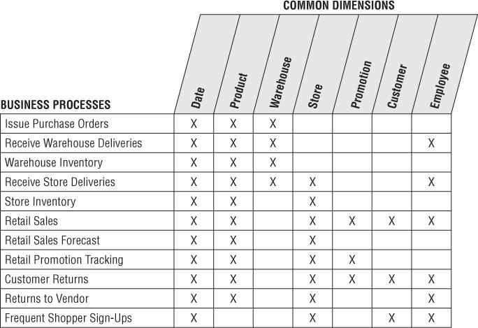

### Facts and dimensions in SQL

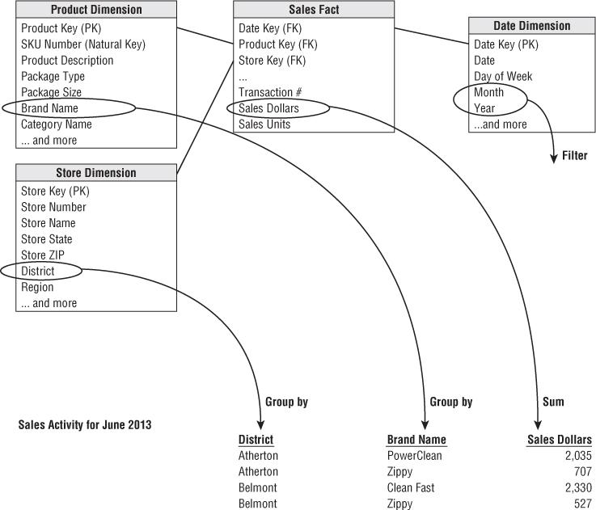

### Facts and dimensions in SQL

[.column]


[.column]

```sql
SELECT
    store.district_name,
    product.brand,
    SUM(sales_facts.sales_dollars) AS "Sales Dollars"
FROM
    store,
    product,
    date,
    sales_facts
WHERE
    date.month_name = 'January' AND
    date.year = 2013 AND
    store.store_key = sales_facts.store_key AND
    product.product_key = sales_facts.product_key AND
    date.date_key = sales_facts.date_key
GROUP BY
    store.district_name,
    product.brand;
```


### Dimensional modeling is not all…

- **Dimensional modeling** (Star schema / “Kimball”)
    
- **Inmon** (Enterprise Data Warehouse, top‑down)
    
- **Data Vault** (Hub‑Link‑Satellite)
    
- **OBT** (One‑Big‑Table / wide table)
    

---

### Tips, tricks, considerations

- **Handling NULLs**
    
    - **Fact tables:** NULL may be acceptable for the measure itself.
        
    - **Dimension FKs:** avoid NULLs; instead use **Unknown** members (e.g., ID = −1, Name = "Unknown").
        
- **Meta‑columns**
    
    - ValidFrom / ValidTo (SCDs)
        
    - CreatedByJobId, ModifiedByJobId, CreatedAt, ModifiedAt, …
        
- **Is it a fact or a dimension?**
    
    - Be careful with entities like **Claim**, **Support ticket**, **Loan application**.
        
    - Avoid **1:1** fact:dimension mapping.
        
- **Dimensions for feature engineering**
    
    - Especially **DimDate** and **DimTime**.
    
### The 5/10 Essential Rules of Dimensional Modeling (Read)[^42]

1. Load detailed atomic data into dimensional structures.
2. Structure dimensional models around business processes.
3. Ensure that every fact table has an associated date dimension table.
4. Ensure that all facts in a single fact table are at the same grain or level of detail.
5. Resolve many-to-many relationships in fact tables.

### The 10/10 Essential Rules of Dimensional Modeling (Read)[^42]

6. Resolve many-to-one relationships in dimension tables.
7.  Store report labels and filter domain values in dimension tables.
8.  Make certain that dimension tables use a surrogate key.
9.  Create conformed dimensions to integrate data across the enterprise.
10. Continuously balance requirements and realities to deliver a DW/BI solution that’s accepted by business users and that supports their decision-making.

[^42]:https://www.kimballgroup.com/2009/05/the-10-essential-rules-of-dimensional-modeling/

### Further reading

- _The Data Warehouse Toolkit_ (3rd ed.) — Kimball & Ross.  
	- Chapter 2 and 3 on [O’Reilly Online](https://learning.oreilly.com/library/view/the-data-warehouse/9781118530801/)
- [Techniques](http://www.kimballgroup.com/wp-content/uploads/2013/08/2013.09-Kimball-Dimensional-Modeling-Techniques11.pdf)
    


## Data Modelling for Big Data

 

^ The Data Landscape: Variety is the Driver

### From data to analysis and execution

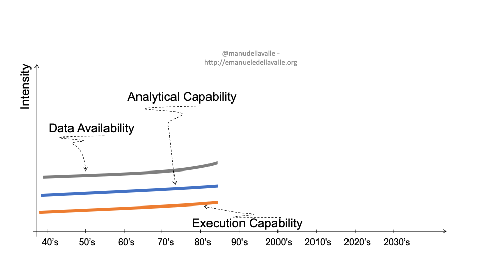

### The appearance of the “Big Data”

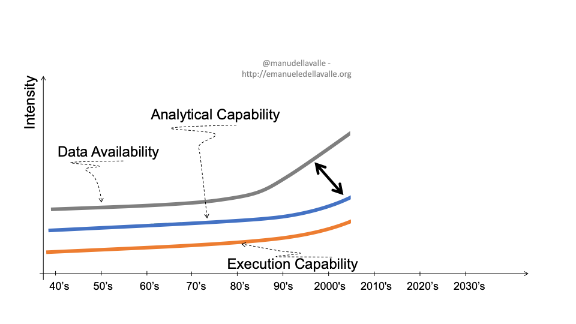


### The Data Landscape

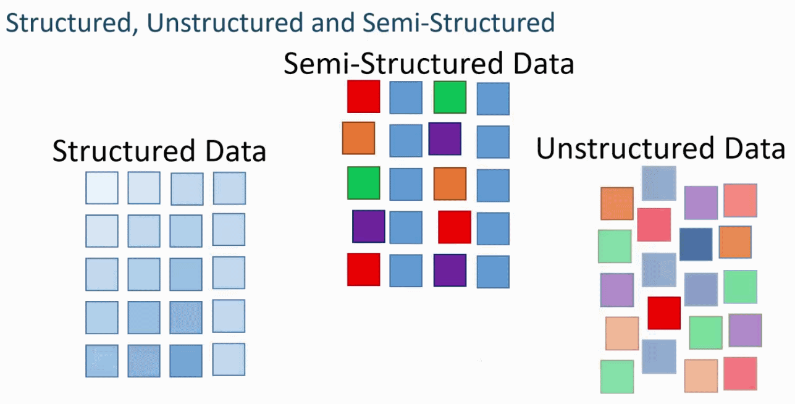

^ Structured data are organized and labeled according to a precise model (e.g., relational data)
^ Unstructured data, on the other hand, are not constrained (e.g., text, video, audio)
^ In between, there are many form of semi-structured data, e.g., JSON and XML, whose models do not impose a strict structure but provide means for validation. 

### Horizontal vs Vertical Scalability

[.footer: Curtesy of Emanuele Della Valle and Marco Brambilla]

### Horizontal vs Vertical Scalability

[.footer: Curtesy of Emanuele Della Valle and Marco Brambilla]

- "Traditional" SQL system scale **vertically** (scale up)	- Adding data to a "traditional" SQL system may degrade its performances
	- When the machine, where the SQL system runs, no longer performs as required, the solution is to buy a better machine (with more RAM, more cores and more disk)
- Big Data solutions scale **horizontally** (scale out)
	- Adding data to a Big Data solution may degrade its performances
	- When the machines, where the big data solution runs, no longer performs as required, the solution is to add another machine

###  hardware
[.footer: Curtesy of Emanuele Della Valle and Marco Brambilla]

[.column]
#### Commodity

- CPU: 8-32 cores
- RAM: 16-64 GB
- Disk: 1-3 TB
- Network: 10 GE

[.column]
#### Appliance

- CPU: 576 cores 
- RAM: 24TB
- Disk: 360TB of SSD/rack
- Network: 40 Gb/second InfiniBand 

^ ORACLE EXADATA DATABASE MACHINE X6-8

### Vertical Scalability
[.footer: Curtesy of Emanuele Della Valle and Marco Brambilla]

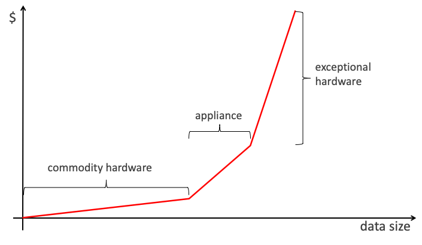


### Horizontal Scalability
[.footer: Curtesy of Emanuele Della Valle and Marco Brambilla]

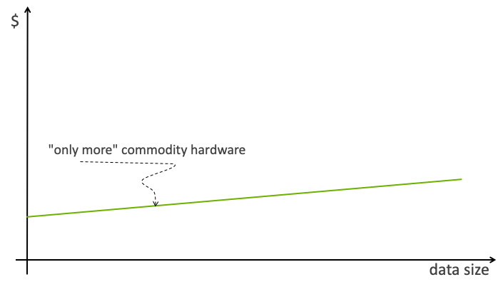

### Vertical vs Horizontal Scalability
[.footer: Curtesy of Emanuele Della Valle and Marco Brambilla]

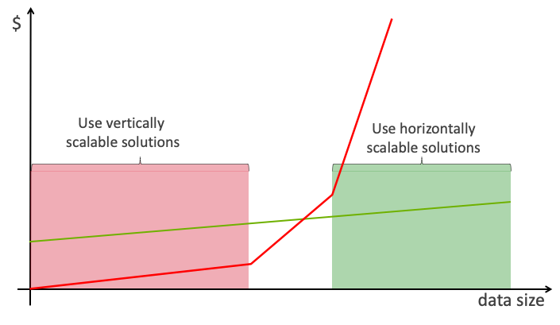


### Vertical vs Horizontal Scalability

[.footer: Curtesy of Emanuele Della Valle and Marco Brambilla]
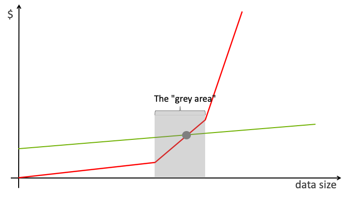


### Grey Area is Time-Dependent

[.footer: Curtesy of Emanuele Della Valle and Marco Brambilla]

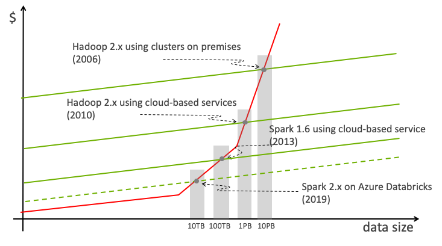

### Big Data Storage

- Distributed File Systems, e.g., HDFS
- NoSQL Databases
- NewSQL Databases[^65] e.g., VoltDB
- Distributed Queues, e.g., Pulsar or Kafka

[^65]: a modern form of relational databases that aim for comparable scalability with NoSQL databases while maintaining the transactional guarantees made by traditional database systems

^ A distributed file system stores files across a large collection of machines while giving a single-file-system view to clients.
[Data Ingestion](obsidian://open?vault=Notes&file=Data%20Ingestion.md)

### Traditional Data Modelling Workflow

- Known as Schema on Write
- Focus on the modelling a schema that can accommodate all needs
- Bad impact on those analysis that were not envisioned

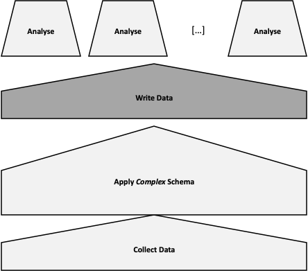

^
 - Extract Transform Load
 - Some analyses may no longer be performed because the data were lost at writing time,

### The Traditional RDBMS Wisdom Is (Almost Certainly) All Wrong[^43]


[^43]: Source with slides: [The Traditional RDBMS Wisdom Is (Almost Certainly) All Wrong,” presentation at EPFL, May 2013](http://slideshot.epfl.ch/play/suri_stonebraker)

### Schema on Read

- Load data first, ask question later
- All data are kept, the minimal schema need for an analysis is applied when needed
- New analyses can be introduced in any point in time

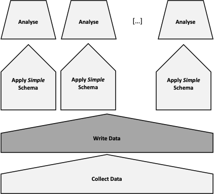

### Data Lakes

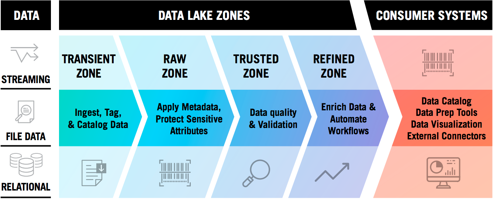

## Logical View of Data Pipelines 


---
### A Simplified view

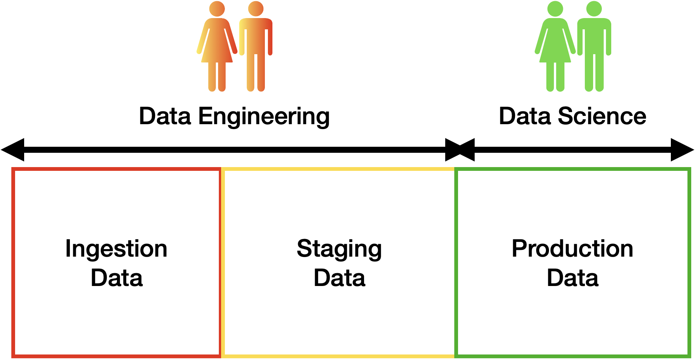

---
### A Simplified view


---
### Our Physical View

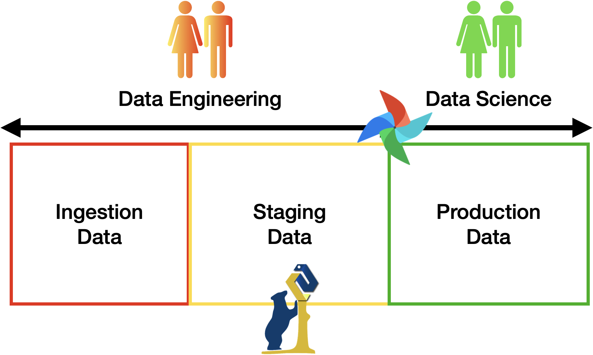

---


### Our Physical View

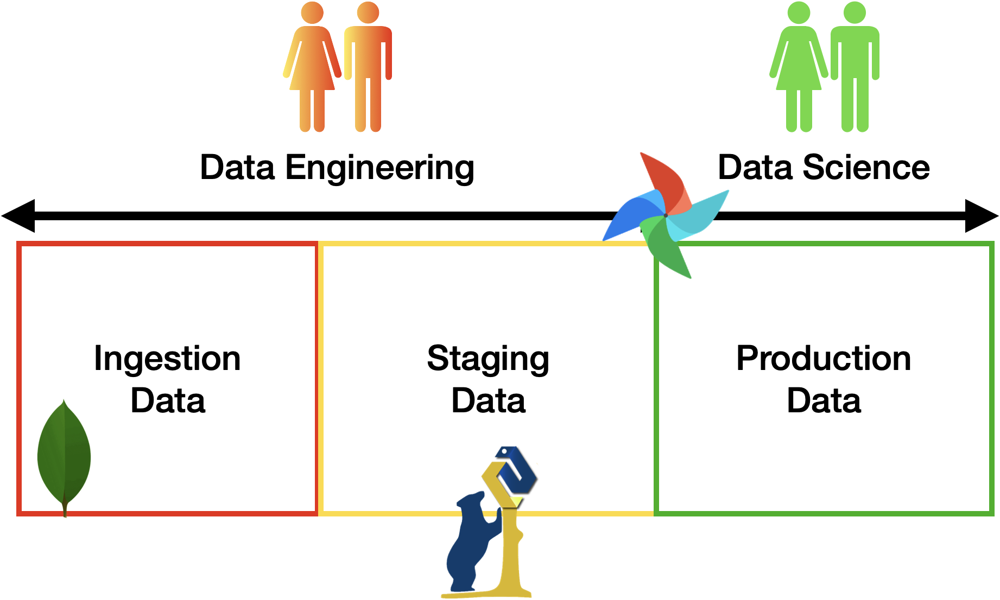

---

### Our Physical View

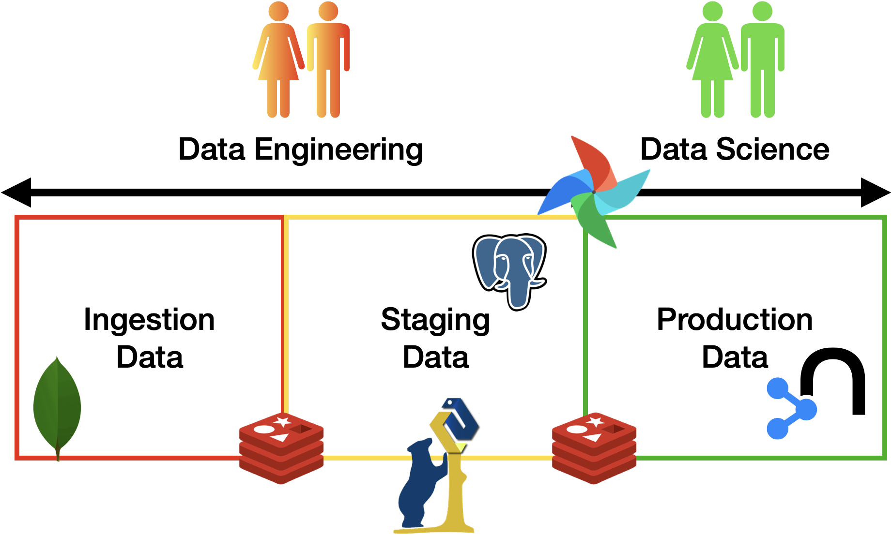

---

### Our Physical View

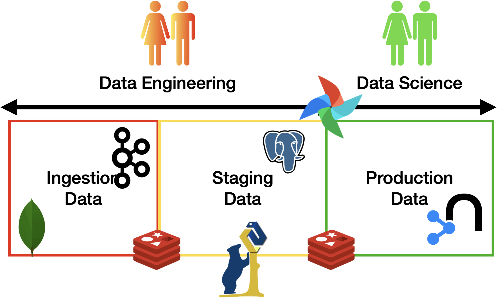
