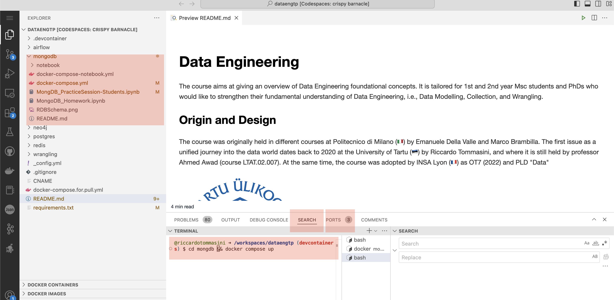

## Mongo DB Practice

The practice works in Docker using Docker Compose.

First of all, watch the video below.



Second, if your are not familiar with MongoDB, make yourself at easy following the [Practice Section.ipynb]([<Practice Section.ipynb>](http://localhost:8888/notebooks/work/data/Practice%20Section.ipynb) Notebook.


Once complete (or right away if you feel confident about MongoDB), complete the [Homework.ipynb](http://localhost:8888/notebooks/work/data/Homework.ipynb) Notebook. 

Notably, you do not have to use the notebooks if your prefere, you can use mongo express client at [http://localhost:8081/](http://localhost:8081/). The notebook are preferable because they use the python client, which makes them easy to port to Airflow for the project. Alternative you could use Mongo Hook (equivalent of the SQL operator). Check the documentation [here](https://airflow.apache.org/docs/apache-airflow-providers-mongo/3.1.1/_api/airflow/providers/mongo/hooks/mongo/index.html#module-airflow.providers.mongo.hooks.mongo). To use it, you need to [create a connection](https://airflow.apache.org/docs/apache-airflow/stable/howto/connection.html).

```python
# dags/mongo_toy_example.py
from datetime import datetime
from airflow import DAG
from airflow.decorators import task
from airflow.providers.mongo.hooks.mongo import MongoHook

# Assumes you have an Airflow connection named "mongo_default"
# Conn Type: MongoDB
# Host: localhost (or your host)
# Schema: example_db
# Extra (optional): {"tls": true, "authSource": "admin"}  # adjust as needed

with DAG(
    dag_id="mongo_toy_example",
    start_date=datetime(2025, 1, 1),
    schedule=None,                    # run manually
    catchup=False,
    tags=["toy", "mongo"],
):

    @task
    def seed():
        hook = MongoHook(mongo_conn_id="mongo_default")
        # Grab a PyMongo collection handle (db from the Airflow connection schema)
        coll = hook.get_collection(collection="widgets")

        # Clean slate for the toy example
        coll.delete_many({})

        # Insert a couple of documents
        docs = [
            {"name": "sprocket", "size": 3, "in_stock": True},
            {"name": "gear",     "size": 5, "in_stock": False},
        ]
        result = coll.insert_many(docs)
        return {"inserted_ids": [str(_id) for _id in result.inserted_ids]}

    @task
    def query(_seed_result):
        hook = MongoHook(mongo_conn_id="mongo_default")
        coll = hook.get_collection(collection="widgets")

        # Simple read: all widgets with size >= 4
        cursor = coll.find({"size": {"$gte": 4}}, projection={"_id": False})
        rows = list(cursor)

        # You could push this to logs / downstream tasks; we just return it
        return rows

    query(seed())
```

At last, deploy Your [Airflow Practice](../02_airflow/) again, and perform a migration exercise:

- From MongoDB to Postgres, converting the MovieDB into a relational database.
- From Postgres to MongoDB, converting the database from OLTP practice into MongoDB

To connect your MongoDB instance with the Airflow Practice use the following command

```sh
    docker network connect airflow_network mongo 
```

Pedagogical Objectives:

- Refreshing your knowledge of MongoDB
- Understand how Document Store represent data, and their difference with relational data
- Learn how to migrate things to MongoDB


## How to Run

You can run it either Locally (as we saw in the docker lecture) or with [Github Codespace](https://30daysof.github.io/data-science-day/week-2/1-codespaces/)


### Locally

- Pull the latest version of this repository
- cd into the mongodb folder
- run docker compose
  - you can use Visualstudio Code
  - you can use a dockerised installation of Jupyter
  - in the compose there is also a mongo express client container to visualise the content of the database. Accessible locally on port 8081
  
### CodeSpace

Open Codespace as indicated in the images below (use the main branch).
And run docker in the codespace. From here on is the same as locally.




### How to run

``` docker compose up -d ```

#### Good to know (MongoDB in the Cloud ([Mongo-Atlas](https://docs.atlas.mongodb.com/getting-started/)))

- If you are using MongoDB in the Cloud (Atlas), you will need to:
    - [Create an Atlas Account and Cluster](https://docs.atlas.mongodb.com/getting-started/)
    - [Set Up Connectivity to Atlas](https://docs.mongodb.com/guides/cloud/connectionstring/)
