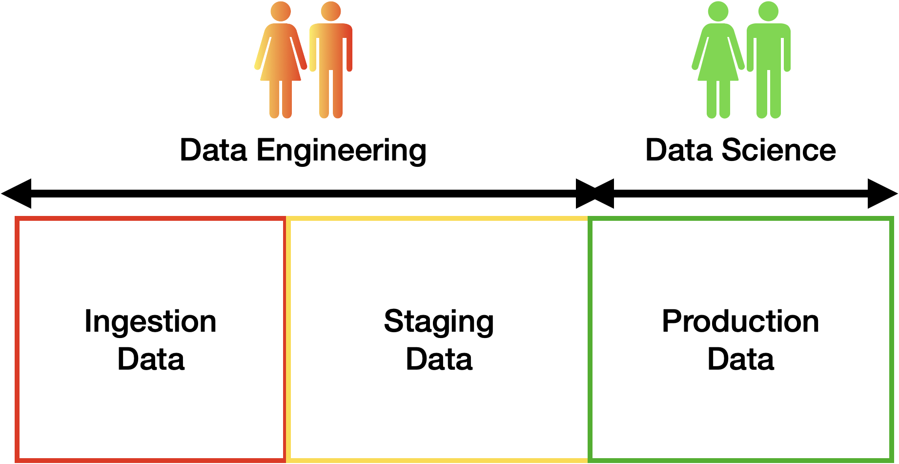

footer:  [Riccardo Tommasini](http://rictomm.me) - riccardo.tommasini@insa-lyon.fr - @rictomm 
slidenumbers: true
autoscale: true
build-lists: true
theme: Plain Jane


## Foundation of Data Engineering
#### MCF Riccardo Tommasini
#### [http://rictomm.me](http://rictomm.me)
#### [riccardo.tommasini@insa-lyon.fr](mailto:riccardo.tommasini@insa-lyon.fr)
 
[.column]

<br>


[.column]


---

## Recap

- The different roles of data engineer and scientist
- Data quality identifies the "zones"
- How do traverse the conceptual zones: pipelines!

^  
- However, the data pipeline has been quite an abstract concept so far
- We still miss the elements that implements the pipeline (Airflow)
- We did not discuss concrete problems like durability and distribution

---

## A Conceptual View of a [Data Pipeline](obsidian://open?vault=dataeng&file=Data%20Pipeline.md)


---


---

## Towards a Physical View

- Big data have an essential role in today's pipeline design 
- As we said, this is **not** just about the size!
	- **Volume**: demands scalability of storage
	- **Variety**: calls for flexibility of schema
	- **Velocity**: requires continuous processing


^ 
- Once again the big data challenges impact the design of our pipelines
- The are all relevant at many levels, but volume is the one that caused most of the changes
- we need to relax some aspects of the data systems 

---

## Towards a Physical View

Before digging into the details of the physical view, we need to unveil two premises

- A Distributed System Premise: Big Data imply data partitioning
- A Data System Premise: Big Data dispute data modelling as it was


---

# [Data Partitioning](obsidian://open?vault=dataeng&file=Data%20Partitioning.md) 

 > breaking a large database down into smaller ones

^ For very large datasets, or very high query throughput, that is not sufficient

##  The main reason for wanting to partition data is scalability[^13]

^ 
- Different partitions can be placed on different nodes in a shared-nothing cluster
- Queries that operate on a single partition can be independently executed. Thus, throughput can be scaled by adding more nodes.

---

## What to know 

- If some partitions have more data or queries than others the partitioning is **skewed**
- A partition with disproportionately high load is called a **hot spot**
- For reaching maximum scalability (linear) partitions should be balanced

Let's consider some partitioning strategies, for simplicity we consider Key,Value data.

---

## Partitioning Strategies

- **Round-robin** randomly assigns new keys to the partitions. 
	- Ensures an even distribution of tuples across nodes; 
- **Range partitioning** assigns a contiguous key range to each node. 
	- Not necessarily balanced, because data may not be evenly distributed
- **Hash partitioning** uses a hash function to determine the target partition. 	- If the hash function returns i, then the tuple is placed


---

# [Data Modeling](obsidian://open?vault=dataeng&file=Data%20Modeling.md)

> It is the process of defining the structure of the data for the purpose of communicating[^11] or to develop an information systems[^12].

[^11]: between functional and technical people to show data needed for business processes

[^12]: between components of the information system, how data is stored and accessed.


---

###  What is a data model? 

- A data model represents the structure and the integrity of the data elements of a (single) applications [2](x-bdsk://DBLP:journals/sigmod/SpynsMJ02) 

- Data models provide a framework for data to be used within information systems by giving specific definitions and formats.

- The literature of data management is rich of data models that aim at providing increased expressiveness to the modeller and capturing a richer set of semantics.


---

## Any Example?


---

<br>

> Data models are perhaps the most important part of developing software. They have such a profound effect not only on how the software is written, but also on how we think about the problem that we are solving[^13].
> --Martin Kleppmann


[^13]:[Designing Data-Intensive Applications](https://dataintensive.net/)

---


---

## Level of Data Modeling

**Conceptual**: The data model defines *WHAT* the system contains.

^ Conceptual model is typically created by Business stakeholders. The purpose is to organize, scope and define business concepts and rules. Definitions are most important this level.

**Logical**: Defines *HOW* the system should be implemented regardless of the DBMS. 

^ Logical model is typically created by Data Architects. The purpose is to developed technical map of rules and data structures. Business rules, relationships, attribute become visible. Conceptual definitions become metadata.

**Physical**: This Data Model describes *HOW* the information system will be implemented using a specific technology [^14].

^ Physical model is typically created by DBA and developers. The purpose is actual implementation of the database. Trade-offs are explored by in terms of data structures and algorithms.


[^14]: [physical](https://www.databass.dev/)

---

### A Closer Look[^15]


[^15]: [slides](https://www.slideshare.net/Dataversity/data-modeling-for-big-data) & [video](https://www.dataversity.net/ldm-webinar-data-modeling-big-data/) by Donna Burbank

^ The variety of data available today encourages the design and development of dedicated data models and query languages that can improve both BI as well as the engineering process itself.

---


---

### Conceptual

- Semantic Model (divergent)
	- Describes an enterprise in terms of the language it uses (the jargon).
	- It also tracks inconsistencies, i.e., semantic conflicts 

- Architectural Model (convergent)
	- More fundamental, abstract categories across enterprise 

---

### Logical 

Already bound to a technology, it typically refers already to implementation details

- Relational
- Hierarchical
- Key-Value
- Object-Oriented
- Graph

^ Since it has a physical bias, you might be tempted to confuse this with the physical model, but this is wrong. 

---

### Physical

The physical level describes how data are **Stored** on a device.

- Data formats
- Distribution
- Indexes
- Data Partitions
- Data Replications

<br>

...an you are in the Big Data World

---

## Towards a Physical View

Before digging into the details of the physical view, we need to unveil two premises

- A Distributed System Premise: [CAP Theorem](CAP%20Theorem)
- A Data System Premise: [NoSQL](Not%20Only%20SQL.md)

---

# [CAP Theorem](obsidian://open?vault=dataeng&file=CAP%20Theorem.md) (Brewer’s Theorem)

It is impossible for a distributed computer system to simultaneously provide all three of the following guarantees:

- **Consistency**: all nodes see the same data at the same time
- **Availability**: Node failures do not prevent other survivors from continuing to operate (a guarantee that every request receives a response whether it succeeded or failed)
- **Partition tolerance**: the system continues to operate despite arbitrary partitioning due to network failures (e.g., message loss)

A distributed system can satisfy any two of these guarantees at the same time but not all three.

---


---

## The network is not reliable

In a distributed system, **a network (of networks) ** failures can, and will, occur.

Since We cannot neglect Partition Tolerance the remaining option is choosing between **Consistency** and **Availability**. 

--- 

## We cannot neglect Partition Tolerance
Not necessarily in a mutually exclusive manner:
	
- CP:  A partitioned node returns
	- the correct value
	- a timeout error or an error, otherwise
- AP: A partitioned node returns the most recent version of the data, which could be stale.

---

## Implications of CAP Theorem 

- change the transactionality gurantees
- redesign the data workflow ()
- reimagine the data processing systems (noSQL)

---

# The Advent of [NoSQL](obsidian://open?vault=dataeng&file=NoSQL.md)


> Google, Amazon, Facebook, and DARPA all recognised that when you scale systems large enough, you can never put enough iron in one place to get the job done (and you wouldn’t want to, to prevent a single point of failure). 
<br>
> Once you accept that you have a distributed system, you need to give up consistency or availability, which the fundamental transactionality of traditional RDBMSs cannot abide.
   --[Cedric Beust](https://beust.com/weblog/2010/02/25/nosql-explained-correctly-finally/)

^  The name “NoSQL” is unfortunate, since it doesn’t actually refer to any particular technology—it was originally intended simply as a catchy Twitter hashtag for a meetup on open source, distributed, non-relational databases in 2009 Cf Pramod J. Sadalage and Martin Fowler: NoSQL Distilled. Addison-Wesley, August 2012. ISBN: 978-0-321-82662-6

---

## The Reasons Behind

- **Queryability**: need for specialised query operations that are not well supported by the relational model
- **Schemaless**:  desire for a more dynamic and expressive data model than relational
- **Flexibility**: need to accomodate the "schema on read" phylosophy

^ 
	- **Big Data**: need for greater scalability than relational databases can easily achieve *in write*
	- **Open Source:** a widespread preference for free and open source software 

---

### Object-Relational Mismatch 

Most application development today is done in **object-oriented** programming languages

An **awkward translation** layer is required between the **objects** in the application code and the database model of **tables**, **rows**, and **columns**

Object-relational mapping (**ORM**) frameworks like **Hibernate** try to mild the mismatch, but they **can’t completely hide** the differences

---


^ the idea of NOSQL actually originates in the late 60s together with the raise of the raise of object-oriented languages, but become popular later.

---

# Shall we rethink the three-layered modelling for Big Data?

---

## Designing NoSQL Data Structures

- NoSQL data structures driven by application design.
  - Need to take into account necessary CRUD operations
- To embed or not to imbed. That is the question!
  - Rule of thumb is to imbed whenever possible.
- No modelling standards or CASE[^case] tools!

[^case]: computer aided software engineering


---

###  Data Modeling for Big Data

- **Conceptual Level** remains:
	- ER, UML diagram can still be used for no SQL as they output a model that encompasses the whole company.

- **Phsyical Level** remains: NoSQL solutions often expose internals for obtaining flexibility, e.g., 
	- Key-value stores API
	- Column stores
	- Log structures

- _Logical level no longer make sense. Schema on read focuses on the query side.__

---

## NoSQL Familty


---

### Kinds of NoSQL (2/4)

NoSQL solutions fall into four major areas:

- **Key-Value Store**
	- A key that refers to a payload (actual content / data)
	- Examples: MemcacheDB, Azure Table Storage, Redis, HDFS

- **Column Store** 
	- Column data is saved together, as opposed to row data
	- Super useful for data analytics
	- Examples: Hadoop, Cassandra, Hypertable

---

### Kinds of NoSQL (4/4)

- **Document / XML / Object Store**
	- Key (and possibly other indexes) point at a serialized object
	- DB can operate against values in document
	- Examples: MongoDB, CouchDB, RavenDB

- **Graph Store**
	- Nodes are stored independently, and the relationship between nodes (edges) are stored with data
	- Examples: AllegroGraph, Neo4j

---

###  Complexity Across Families


---
### Dependencies Across Families


^ a natural evolutionary path exists from simple key-value stores to the highly complicated graph databases, as shown in the following diagram:

---

### SQL vs  NoSQL

| SQL databases                              | NoSQL  databases                                                                                     |
| ------------------------------------------ | ---------------------------------------------------------------------------------------------------- |
| Triggered the need of relational databases | Triggered by the storage needs of Web 2.0 companies such as Facebook,Google and Amazon.com           |
| Well structured data                       | Not necessarily well structured – e.g., pictures, documents, web page description, video clips, etc. |
| Focus on data integrity                    | focuses on availability of data even in the presence of multiple failures                            |
| Mostly Centralised                         | spread data across many storage systems with a high degree of replication.                           |
| ACID properties should hold                | ACID properties may not hold[^62]                                                                    |
|                                            |                                                                                                      |

[^6 g2]: no properties at all???

---

## NoSQL & CAP Theorem

---


[.footer: [img](https://blog.nahurst.com/visual-guide-to-nosql-systems)]

---

### The ~~OLD~~ ACID Model

-   ACID, which stands for Atomicity, Consistency, Isolation, and Durability[1-1](obsidian://open?vault=dataeng&file=1-1.md)(app://obsidian.md/index.html#fn-1-799ed3e7c985b657)
    
-   **Atomicity** refers to something that cannot be broken down into smaller parts.
    
    -   It is not about concurrency (which comes with the I)
-   **Consistency** (overused term), that here relates to the data _invariants_ (integrity would be a better term IMHO)
    
-   **Isolation** means that concurrently executing transactions are isolated from each other.
    
    -   Typically associated with serializability, but there weaker options.
-   **Durability** means (fault-tolerant) persistency of the data, once the transaction is completed.
    

^ The terms was coined in 1983 by Theo Härder and Andreas Reuter [6](obsidian://open?vault=dataeng&file=6.md)(app://obsidian.md/index.html#fn-6-799ed3e7c985b657)

---

### Rationale to Change

- It’s ok to use stale data (Accounting systems do this all the time. It’s called “closing out the books.”) ; 
- It’s ok to give approximate answers
- Use resource versioning -> say what the data really is about – no more, no less
	- the value of x is 5 at time T

---

### The New BASE Model

BASE(Basically Available, Soft-State, Eventually Consistent)

- **Basic Availability**: fulfill request, even in partial consistency.
- **Soft State**: abandon the consistency requirements of the ACID model pretty much completely
- **Eventual Consistency**: delayed consistency, as opposed to immediate consistency of the ACID properties[^67].
  - purely aliveness guarantee (reads eventually return the requested value); but
  - does not make safety guarantees, i.e.,
  - an eventually consistent system can return any value before it converges

[^67]: at some point in the future, data will converge to a consistent state; 

---

### ACID vs. BASE trade-off

**No general answer** to whether your application needs an ACID versus BASE consistency model.

Given **BASE** ’s loose consistency, developers **need to** be more knowledgeable and **rigorous** about **consistent** data if they choose a BASE store for their application.

Planning around **BASE** limitations can sometimes be a major **disadvantage** when compared to the simplicity of ACID transactions.

A fully **ACID** database is the perfect fit for use cases where data **reliability** and **consistency** are essential.

---

## Extra Reads

- [History of Data Models by Ilya Katsov](https://highlyscalable.wordpress.com/2012/03/01/nosql-data-modeling-techniques/)

- [Life beyond Distributed Transactions](https://www.ics.uci.edu/~cs223/papers/cidr07p15.pdf)

---

# Refining the Initial View

---


---
## A Simplified view



---
## A Simplified view


---
## Our Physical View


---


## Our Physical View


---

## Our Physical View


---

## Our Physical View


---

# MongoDB


---

## History and Motivation

  - An open source and document-oriented database.
  - Data is stored in JSON-like documents.
  - Designed with both scalability and developer agility.
  - Dynamic schemas.
  - Automatic data sharding

---

## What MongoDB is :

- An In-Memory [Document Databases](obsidian://open?vault=dataeng&file=Document%20Databases.md)
- Strong consistency (**C**)
- *Tuneably* available (**~~A~~**)
- Horizontal Scalable  (**P**)


---

## What MongoDB is not 

- Always Available[^91]
- No Schemas
- No transactions
- No joins
- Max document size of 16MB[^92]

[^91]: Larger documents handled with GridFS

[^92]: there will always be downtime when (i) the new leader is getting elected or (ii) the client driver disconnects from the leader

---

## Use Cases

-  Capture **game** events, scaling to meet high-write workloads.
-  Financial Services:  Risk Analytics & Reporting, Trade Repository
-  manufacturing, automotive, retail, and energy
-   fast-changing sensor data captured from multiple devices and experiments

---

## When to consider MongoDB 

- When you don't need high availability of data
- when you need fast and instant data recovery
- when do not want to sustain schema migration costs

---

### Advantages
- Full featured indexes
- Sophisticated query language
- Easy mapping to object-oriented code
- Native language drivers in all popular languages
- Simple to set up and manage
- Operates at in-memory speed wherever possible
- Auto-sharding built in
- Dynamically add / remove capacity with no downtime

---


---

### Terminology: SQL vs MongoDB

|     SQL   Terms/Concepts                   |     MongoDB   Terms/Concepts                 |
|--------------------------------------------|----------------------------------------------|
|     database                               |     database                                 |
|     table                                  |     collection                               |
|     row                                    |     document                                 |
|     column                                 |     field                                    |
|     index                                  |     index                                    |
|     table   joins (e.g. select queries)    |     embedded   documents and linking         |
|     Primary   keys                         |     _id   field is always the primary key    |
|     Aggregation  (e.g. group by)           |     aggregation pipeline             |


---

## Data Model: Structure of a JSON-document:


The value of  field:
    - Native data types
    - Arrays
    - Other documents

---

## Data Model: Collections  of  Documents


> Rule: Every document must have an _id.

---

## Data Model: Embedded documents:


---

### Reference documents


---

### Storage: BSON Format

- Binary-encoded serialization of JSON-like documents optimized for space and speed
- BSON types are a superset of JSON types[^94]
- Zero or more key/value pairs are stored as a single entity[^93]
- Large entities are prefixed with a length field to facilitate scanning


[^93]: Each entry consists of a field name, a data type, and a value

[^94]: JSON does not have a date or a byte array type, for example

---

# Operations


---

### Create
Create a database

```
use database_name
```

Create a collection

```
db.createCollection(name, options)
```

---

### Insert 

```python
db.<collection_name>.insert({"name": "nguyen". "age": 24, "gender": "male"})
```

```python
db.employee.insert({
    name: "sally",
    salary: 15000,
    designation: "MTS",
    teams: [ "cluster-management" ]
})`
```

---

### Read
```
  db.<collection_name>.find().pretty()
```
  
```python
db.employee              #collection
    .find( { 
    salary: {$gt:18000}, #condition
        {name:1}         #projection
    }) 
.sort({salary:1})        #modifier
```  

---

### Update

```python

db.employee #collection
.update(
 {salary:{$gt:18000}}, #Update Criteria
 {$set: {designation: "Manager"}}, #Update Action 
 {multi: true} #Update Option 
)
```

^ Multi-option allows multiple document update

---

### Delete

```python
db.employee.remove(
     {salary:{$lt:10000}}, #Remove Criteria
)
```

---

### Aggregates

SQL-like aggregation functionality

Pipeline documents from a collection pass through an aggregation pipeline

Expressions produce output documents based on calculations performed on input documents

Example:

```python
db.parts.aggregate( 
    {$group : {_id: type, totalquantity : 
    { $sum: quantity}
}})
```

---
[.column]

#### Save


```python
db.employee.save(
    {  _id:ObjectId('string_id'),
       "name": "ben", 
       "age": 23, 
       "gender": 
       "male"
})
```

[.column]

#### Drop

  - Drop a database
  - 
```python
Drop it: db.dropDatabase()
```
  
  - Drop a collection:
 
```python
db.<collection_name>.drop()
 ```

---

### Mapping to SQL

|     SQL   Statement                                                |     MongoDB   commands                        |
|--------------------------------------------------------------------|-----------------------------------------------|
|     SELECT   *      FROM   table                                   |     db.collection.find()                      |
|     SELECT   *      FROM   table     WHERE   artist = ‘Nirvana’    |     db.collection.find({Artist:”Nirvana”})    |
|     SELECT*     FROM   table     ORDER   BY Title                  |     db.collection.find().sort(Title:1)        |
|     DISTINCT                                                       |     .distinct()                               |
|     GROUP   BY                                                     |     .group()                                  |
|     >=,   <                                                        |     $gte,   $lt                               |

---

### Comparison Operators


[source](https://docs.mongodb.org/manual/reference/operator/query)

---

### Indexes

- B+ tree indexes
- An index is automatically created on the _id field (the primary key)
- Users can create other indexes to improve query performance or to enforce Unique values for a particular field
- Supports single field index as well as Compound index
- Like SQL order of the fields in a compound index matters
- If you index a field that holds an array value, MongoDB creates separate index entries for every element of the array

---

### Sparse Indexes

- Sparse_- property of an index ensures that the index only contain entries for documents that have the indexed field. (so ignore records that do not have the field defined)

- If an index is both unique and sparse – then the system will reject records that have a duplicate key value but allow records that do not have the indexed field defined

---

## Architecture


- Mongod – Database instance

- Mongos - Sharding processes:
  - Like a database router processes all requests
  - Decides how many and which *mongod* should receive the query
  - No local data
  - Collects the results, and sends it back to the client.

- Config Server
  – Stores cluster chunk ranges and locations
  – Can have only 1 or 3 (production must have 3)

---

### Mongod and Mongos


---

### Client

- Mongo – an interactive shell ( a client)
- Fully functional JavaScript environment for use with a MongoDB
- You can have one mongos for the whole system no matter how many mongods you have
- OR you can have one local mongos for every client if you wanted to minimize network latency.

---

## Replication
For redundancy MongoDB provides asynchronous replication. 

Only one database node is in charge of write operations at any given time (called primary server/node). 

Read operations may go to this same server for strong consistency semantics or to any of its replica peers if eventual consistency is sufficient.

---

### Master Slave Replication

Consists of two servers out of one which takes the role of a master handling write requests and replicating those operations to the second server, the slave.


---

### Replica Sets

Consists of groups of MongoDB nodes that work together to provide automated failover.

^ Replica Sets are described as an "an elaboration on the existing master/slave replication, adding **automatic failover** and automatic recovery of member nodes"

---

## Partitioning
- called Sharding in MongoDB
- User defines shard key for partitioning
- Shard key defines range of data
- Key space is like points on a line
- Range is a segment of that line

---

### What is a Shard?

- Shard is a node of the cluster
- Shard can be a single mongod or a replica set
- Default max chunk size: 64mb
- MongoDB automatically splits & migrates chunks when max reached


---

### Auto-sharding

- Minimal effort required
  - Enable Sharding for a database
  - Shard collection within database
  - Decide Sharding Strategy

---

### MongoDB Sharding Strategies

- Ranged
- Hashed
- Tag-aware

---

#### Range Sharding

- Splits shards based on sub-range of a key (or also multiple keys combined)
  - Simple Shard Key: {deviceId}
  - Composite Shard Key: {deviceId, timestamp}


---
#### Hash Sharding

- MongoDB applies a MD5 hash on the key when a hash shard key is used:
  - Hash Shard Key(deviceId) = MD5(deviceId)
  - Ensures data is distributed randomly within the range of MD5 values


---
#### Tag Sharding

Tag-aware sharding allows subset of shards to be tagged, and assigned to a sub-range of the shard-key.

Example: Sharding User Data belong to users from 100 “regions”

Collection: Users, Shard Key: {uId, regionCode}

Tag based on macro regions

---
#### Tag Sharding Example


---
#### Which Sharding to use?


---

### Routing and Balancing


- Queries routed to specific shards
- MongoDB balances cluster
- MongoDB migrates data to new nodes

---

### MongoDB Security

- SSL
  - between client and server
  - Intra-cluster communication
- Authorization at the database level
  - Read Only/Read+Write/Administrator

---
### References

- [Mongodb.com](http://www.mongodb.com/nosql-explained)
- No SQL Distilled by P. Sadalage and M. Fowler
- MongoDB Applied Design Patters by R. Copeland
- The Definitive Guide to MongoDB by Plugge, Membry and Hawkins

